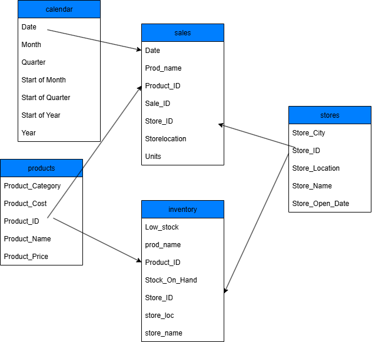
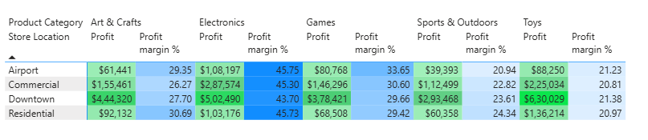
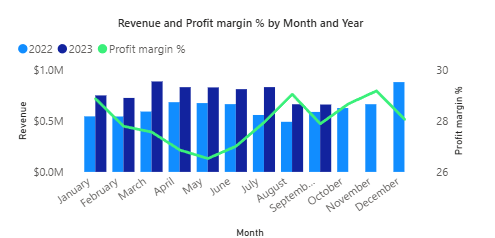
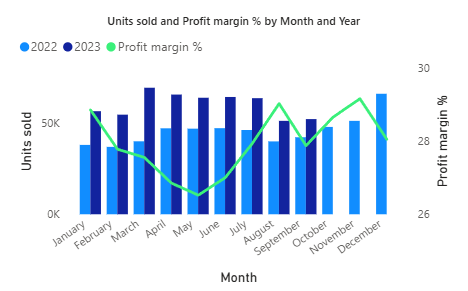

# Maven Toys: Sales & Inventory Analytics 

## Analysis of sales and inventory data from 2022 – Sept 2023 for a fictitious toy retailer in Mexico.

### Project Background

Maven Toys is a fictitious chain of toy stores in Mexico, with locations across major cities such as Mexico City, Monterrey, Guadalajara, Puebla, and other regional hubs. The company sells a wide range of toys across multiple categories and relies heavily on sales and inventory data to guide its business decisions.

In this project, I take on the role of a Data Analyst, collaborating with management and cross-functional teams (marketing, supply chain, and finance) to uncover profit drivers, seasonal sales trends, stockout issues, and inventory efficiency. The goal is to deliver actionable insights that support decision-making across the business.

### Objectives

This analysis aims to evaluate sales and inventory performance for Maven Toys and address four key business questions. Each question is supported by specific KPIs to ensure measurable, actionable insights.

**- Which product categories drive the biggest profits? Is this the same across store locations?**

KPIs:

- Total Revenue ($)

- Gross Profit ($ and %)

- Profit Margin by Category and Location

**- Can you find any seasonal trends or patterns in the sales data?**

KPIs:

- Revenue

- Profit Margin %

- Units Sold

**- Are sales being lost with out-of-stock products at certain locations?**

KPIs:

- Stock on Hand (units, snapshot as of Sept 30, 2023)

- Sales Volume (Aug–Sep 2023) for low-stock products

**- How much money is tied up in inventory at the toy stores? How long will it last?**

KPIs:

- Inventory Value at Cost ($)

- Inventory Value at Retail ($)

- Inventory Units on Hand (units)

- Inventory Coverage (days of stock remaining)

  

### Executive Summary

Maven Toys’ analysis shows that profitability is largely driven by Toys, with Games and Sports & Outdoors shaping margins, while Electronics provide steady returns — together contributing a total of $14.44M in revenue from 1M units sold between 2022 and Sept 2023. Sales follow a predictable seasonal pattern, peaking in spring and December and dipping in August, underscoring the need for cycle-aligned promotions and inventory planning. As of Sept 30, 2023, the company holds 30K units of stock valued at $300K (cost) / $410K (retail), providing just 18 days of coverage at recent sales rates. Downtown stores contribute the major share of profits but also account for the highest number of low-stock locations, with five key stores (IDs 5, 8, 13, 24, 41) combining high demand with limited inventory — putting them at immediate risk of lost sales if replenishment is delayed.

 

 

 

 

### Insights Deep Dive

#### Profitability by Product Category and Store

Findings (2022 – Sept 2023 combined)

Across all categories, total profit reached $4.01M with an overall profit margin of 27.79%.

 

 

**By total profit:**

- Toys led with $1.08M, followed closely by Electronics ($1.00M).

- Arts & Crafts contributed $0.75M, while Games added $0.67M.

- Sports & Outdoors generated the lowest profit.

**By profit margin (%):**

- Electronics (44.6%) had the strongest margins, followed by Games (30.3%) and Arts & Crafts (27.9%).

- Sports & Outdoors (23.3%) performed below average.

- Toys, despite being the top profit generator, had the lowest margin, making it dependent on high sales volumes.
  

#### Profitability Across Store Locations 

 

Findings (2022 – Sept 2023 combined)

 

 

 

 

**Downtown Stores**

- Total Profit: $2.25M (Profit Margin: 27.36%)

**Key profit drivers:**

- Toys: $630K

- Electronics: $502K

Large sales volumes make Downtown the biggest contributor to total profit.

**Airport Stores**

- Total Profit: $378K (Profit Margin: 29.31%)

**Key profit drivers:**

- Electronics: highest margin category (45.75%)

- Toys: lower margin (21.23%)

Lower sales volume, but stronger margins compared to Downtown.

**Overall Pattern**

Across all locations, Toys and Electronics drive the highest absolute profits.

Electronics consistently leads in profit margins, followed by Games.

#### Seasonal Trends and Patterns 

**Revenue Trend**

Revenue trends across both years show a clear double-peak sales cycle. In 2022, sales rose steadily from January and peaked in **April**, before dipping mid-year, with **August** marking the lowest point in both revenue and units sold. A strong recovery followed, ending with the highest revenue in **December**, reflecting the classic holiday season effect.

In 2023, the cycle followed a similar shape but peaked earlier, in **March**, and then held steady through the spring months. The **sharp August dip** repeated, confirming this as a consistent seasonal trough. By September, recovery was underway, mirroring the previous year’s Q4 uplift.

 

 

 

 

**Category-Level Seasonal Trends**

**2022 Revenue Patterns**

 
 Revenue trends in 2022 show that **Toys** were the **strongest driver of company seasonality**, with a clear peak in March–April, a sharp dip in August, and recovery toward year-end. **Sports & Outdoors** mirrored this cycle closely, reinforcing the overall pattern. Games were more volatile but delivered a strong lift in November–December, helping explain the year-end revenue peak. **Arts & Crafts** generally followed the company curve but **dipped sharply in October** before rebounding. Electronics, in contrast, performed steadily but softened in September–December, meaning it did not contribute meaningfully to the December peak.

**2023 Revenue Patterns**

In 2023, the overall **March peak and August–September trough** were primarily driven by **Toys and Sports & Outdoors**, both of which mirrored the company-level curve closely. Arts & Crafts followed a similar trend with slightly delayed timing. Electronics declined steadily month after month, dragging overall performance rather than driving peaks. **Games weakened compared to 2022**, showing declines rather than contributing strongly to the seasonal highs.

 

 

 

 

Across both years, Toys and Sports & Outdoors are the categories most responsible for driving the company’s seasonal revenue cycles. Games provide additional lift at year-end, while Electronics remain steady but less aligned with overall demand patterns.

**Units Sold Trend**

In **2022**, units sold **steadily climbed from January to April**, peaking in line with revenue. Sales then **flattened in May–June**, before **dropping sharply in August**, the lowest point of the year. **A recovery followed, with December** peaking once again, mirroring revenue’s holiday surge.

In **2023**, the pattern repeated with only a slight shift in timing. Units sold **rose through March** (the spring peak, one month earlier than 2022) and remained stable until July. The **sharp August trough returned**, extending into September before the recovery began.

 

 

 

 

Units sold mirror the revenue cycle almost exactly, confirming that seasonality is demand-driven. Customers purchase fewer units in August and more in April/December. The consistency across both years suggests a structural seasonal cycle rather than one-off anomalies.

**Profit Margin trends**

In **2022**, profit margins **moved largely opposite to sales volume**. Margins were relatively **stable between January and March**, but **dipped sharply during the April–May sales peaks**, driven by seasonal promotions and higher sales of lower-margin categories like Toys & Games. From **June through August, margins rose steadily**, peaking in August, despite revenue and units being at their lowest. This confirmed August was a genuine demand trough rather than a discount period. Margins then stabilized in September–November before dipping again in December, when heavy holiday discounting and mix shifts reduced profitability.

In **2023**, the trend was consistent. **Margins steadily declined from January through July**, even as revenue and units held stable after March. In **August–September, margins rose again** while sales fell, **repeating the 2022 pattern**. If Q4 follows the previous year, margins are likely to flatten in October–November and dip in December with holiday promotions.

 

 

 

 

High sales months like April and December coincide with lower margins, while low-sales months like August and September see higher margins. This highlights how volume is achieved at the expense of profitability, while quieter months result in more profitable sales mixes.

**Category wise trends in Profit Margin**

In **2022**, company-level profit margins **declined through April–May**, **rose steadily to a peak in August**, and then **fell again in September and December**. Category analysis reveals that **Games, Sports & Outdoors, and Toys were the strongest drivers** of these margin swings. Games rose sharply from May to August, closely mirroring the August margin peak. Sports & Outdoors showed a steady increase from May through December, reinforcing the overall trend. Toys also peaked in August, almost exactly matching the company margin curve. Arts & Crafts followed a similar pattern but less sharply, making it a secondary contributor. Electronics, while consistently maintaining high margins of 47–49%, showed little seasonal movement and therefore had less impact on company-level margin fluctuations.

In **2023**, profit margins **again showed a seasonal cycle**, though with some category differences compared to 2022. **Margins declined through the first half of the year before recovering in August–September, mirroring the company-level rebound**. **Toys and Sports & Outdoors were the strongest drivers**, both closely aligned with the overall margin trend. **Arts & Crafts partially supported the Jul–Sep recovery**, while Electronics provided stable, high margins with a gentle upward slope. **Games, however, diverged from the company pattern**, showing weaker alignment and little contribution to the late-year rebound. Overall, **Toys and Sports & Outdoors dominated** both revenue and margin seasonality, making them the core categories driving company performance in 2023.

 

 

 

 

While Toys drive volume and revenue seasonality, Games, Sports & Outdoors, and Toys together drive the margin seasonality. Electronics remain profitable but stable, with limited impact on seasonal swings.

#### Impact of Stockouts on Sales

**Low Stock and High Sales Stores**

Analysis shows that stores with IDs 1, 2, 3, 4, 5, 6, 7, 8, 11, 13, 14, 15, 16, 17, 18, 19, 20, 22, 24, 25, 27, 28, and 32 currently hold low stock levels for certain products. Within this group, Stores 5, 8, 13, 24, and 41 stand out as having both high sales in Aug–Sep 2023 and a higher number of low-stock products. These stores are at greater risk of lost sales if replenishment is not addressed promptly, as their strong demand combined with constrained inventory could lead to missed revenue opportunities.

 

 

 

 

**Downtown Locations at Greater Risk**

Among all store locations, Downtown stores show the highest concentration of low-stock issues. Within this group, five stores combine low inventory with high sales in Aug–Sep 2023, placing them at an elevated risk of lost sales if stock levels are not replenished quickly. This highlights Downtown as a priority area for inventory management and replenishment planning.

 

 

 

 

**Low Stock by Product Category**

Low stock issues are most concentrated in Toys (33 items) and Arts & Crafts (21 items), together accounting for over 70% of all low-stock cases. Sports & Outdoors (14 items) also shows notable stock pressure. In contrast, Electronics (4) and Games (5) currently face relatively fewer low-stock challenges. This suggests that replenishment efforts should prioritize the Toys and Arts & Crafts categories to minimize the risk of unmet demand.

 

 

 

 

**Inventory Position**

Toy stores currently have **30K units in stock**, valued at **$300K at cost (or ~$410K at retail price)**. Based on recent 2 months sales trends, this **stock would last for about 18 days**, which is slightly above the **year-to-date coverage of ~15 days**. This indicates that while stock levels are sufficient in the short term, the limited coverage window reinforces the need for timely replenishment to avoid future shortages.

### Recommendations

- **Plan proactively for seasonal peaks and troughs**
  
Maven Toys shows strong, predictable seasonality — sales surge in spring and December and fall sharply in August. Inventory replenishment, staffing, and marketing campaigns should be aligned to these cycles to capture peak demand and reduce overstock in slower months.

- **Integrate demand-driven inventory planning**

Demand fluctuations are consistent year over year. Stocking up ahead of spring and holiday peaks, while scaling back in mid-year troughs, will help minimize lost sales in high-demand months and reduce carrying costs when demand dips.

- **Balance sales growth with profitability**
  
Profit margins move opposite to sales volume — margins dip during peak sales months due to discounts and promotions, and rise in slower months when customers pay full price. Management should optimize discount strategies: protect margins in high-demand months by avoiding excessive promotions, while using targeted campaigns in slower months to stimulate demand.

- **Prioritize key categories for strategic focus**

**Toys** → main driver of both revenue peaks and volatility → must be the top focus for volume planning.

**Sports & Outdoors** → shapes seasonal demand trends → align inventory closely to peak cycles.

**Games** → key contributor to margins → should be monitored to maintain profitability during low sales months.

**Electronics** → steady but not seasonal → can be positioned as a stabilizer category for margins.

**Arts & Crafts** → moderate contribution → can support consistent baseline demand.

### Clarifying Questions

*Questions to Stakeholders before analysis*

- Inventory data meaning – Does **Stock_on_Hand** column reflect a one-time snapshot (e.g., Sept 30, 2023) or a daily rolling balance? And if a product is missing from the inventory table, should it be treated as zero stock or simply not tracked?

- Sales data scope – Should the analysis focus only on recent sales (e.g., Aug–Sep 2023) as a demand baseline, or do we need to consider a longer seasonal view (e.g., last 12 months)?

- Lost sales definition – Since we only have sales history until Sept 30, 2023, should “lost sales” be interpreted as:
  
  (a) actual missed sales (which cannot be observed in the data), or
  
  (b) potential future lost sales risk, inferred from products with zero stock today that had strong recent sales?

### Assumptions & Caveats

- Lost sales are inferred, not observed. Because sales data ends Sept 30, 2023, the analysis can only flag potential risk of lost sales where products are out of stock and had recent sales activity. Actual lost sales beyond Sept cannot be confirmed with the data provided.
